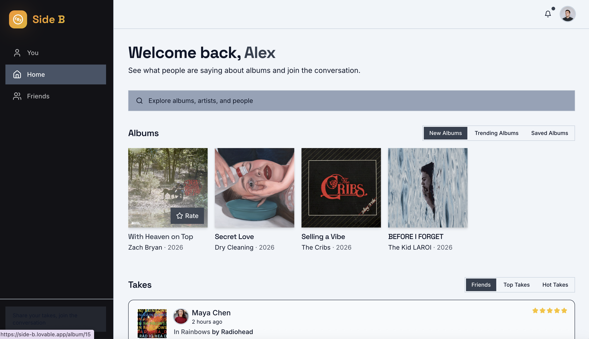
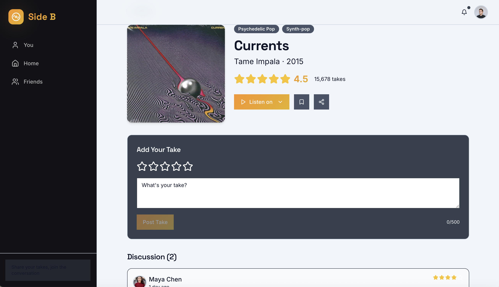
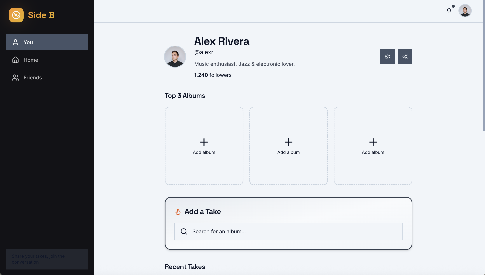
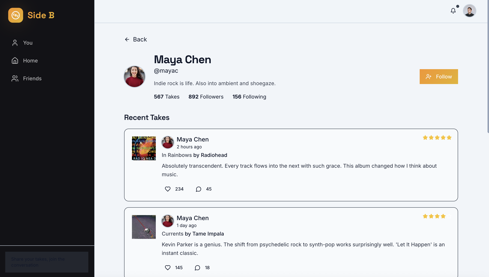

# Side B

Side B is a social music rating and discovery app designed to encourage thoughtful, non-toxic takes on albums and artists. Think Letterboxd for music, but optimized for constructive engagement and future AI-powered recommendations.

## Live Demo

[https://side-b.lovable.app]

## Product Screenshots

### Home Feed
Discovery layer combining trending albums, structured ratings, and social engagement in a single surface.

<p align="center">
  
</p>

---

### Album Detail
Aggregate ratings, discussion, and take submission.

<p align="center">
  
</p>

---

### User Profile
Top albums, follower graph, and recent takes.

<p align="center">
  
</p>

---

### Social Layer
Follow users and engage with their takes.

<p align="center">
  
</p>


## Core Features

- ⭐ Structured album rating system
- 🗣 Social feed of user takes and discussions
- 👤 Curated user profiles with Top 3 albums
- 🔥 Trending and new release discovery
- 🤝 Follow other users and engage with their activity

## Why I Built This

Music discovery platforms tend to optimize for volume and virality rather than quality of engagement. I wanted to explore what a music community might look like if it rewarded structured, thoughtful interaction instead of low-effort hot takes.

Side B is an experiment in product mechanics: how ratings, feeds, and discovery systems can be designed to encourage signal over noise. It also serves as a foundation for layering AI-driven recommendations on top of explicit user preferences rather than opaque algorithmic guesses.

This project reflects my broader interest in building products that combine structured user input, social mechanics, and intelligent recommendation systems.

## Tech Stack

- React
- TypeScript
- Vite
- Tailwind CSS
- shadcn/ui
- Built and iterated using Lovable

## Running Locally

```bash
npm install
npm run dev
```

## Product Roadmap

Planned evolutions for Side B:

- Account-based user profiles with persistent rating history
- AI-assisted album recommendations based on explicit user preferences
- Playlist export integrations (Spotify / Apple Music)
- Social graph features (following, activity feed personalization)
- Structured review prompts to encourage higher-quality music discourse

Built by Brian Mandel
